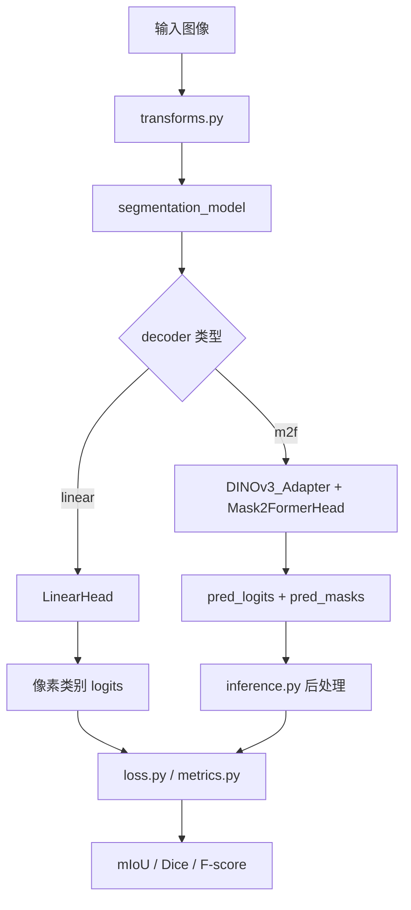
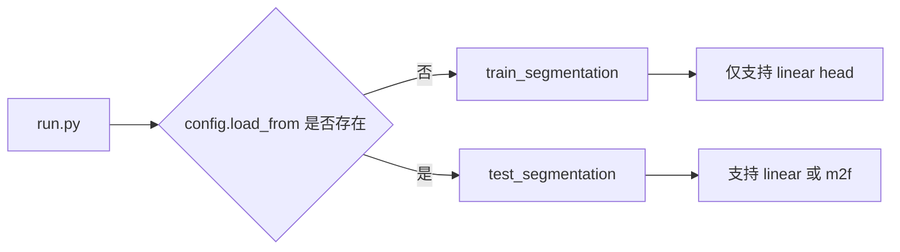
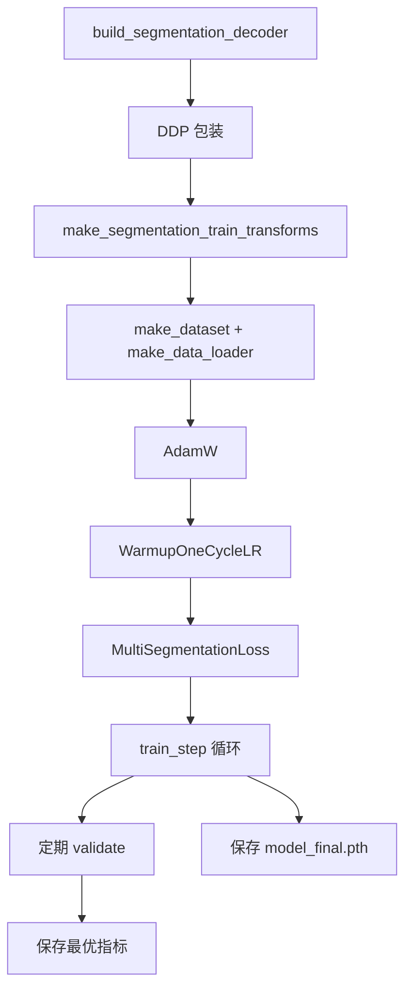
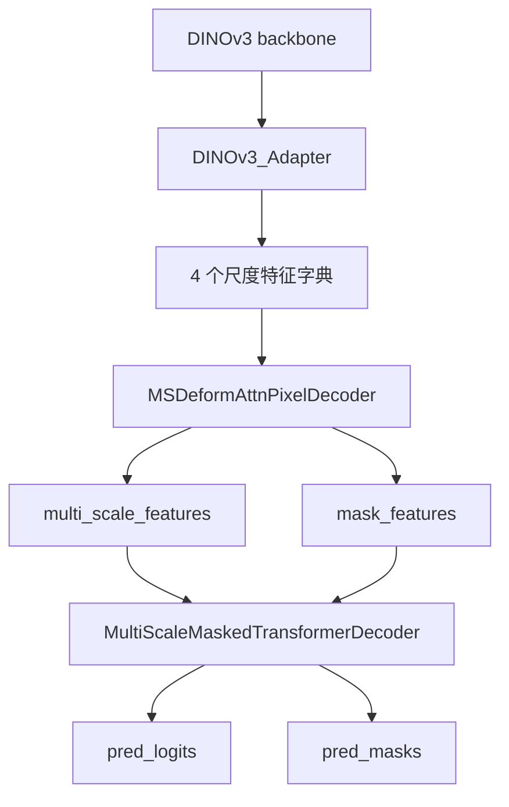
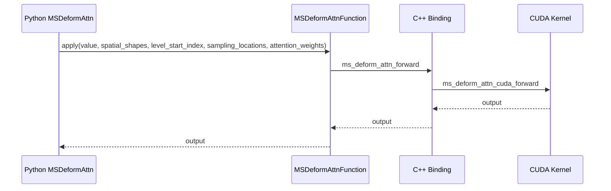

# DINOv3 分割评估模块详解

本文档对应目录 `dinov3/eval/segmentation`，目标不是简单介绍“怎么调用”，而是把这套代码的设计拆开讲明白：

- 它解决什么问题
- 训练和推理分别走哪条路径
- DINOv3 主干、线性头、Mask2Former 头如何拼起来
- 多尺度可变形注意力是怎样从 Python 落到 CUDA 扩展的
- 哪些配置是关键参数，哪些实现细节值得特别注意

如果你第一次读这一块代码，建议先看“整体架构”和“训练/推理调用链”，再回到各文件说明。

## 1. 这套代码到底在做什么

这不是一个独立的语义分割项目，而是 DINOv3 仓库中的一个下游评估模块。它复用 DINOv3 的视觉主干，把分割任务拆成两类模式：

1. 线性头训练与评估
   - 使用冻结的 DINOv3 backbone
   - 从 backbone 取一层或多层中间特征
   - 用一个非常轻量的 `LinearHead` 做像素分类
   - 这条路径用于低成本评估 backbone 的分割表征能力

2. Mask2Former 头推理与评估
   - 使用 `DINOv3_Adapter` 把 ViT 特征转成多尺度特征
   - 再接 `Mask2FormerHead`
   - 内部包含 pixel decoder 和 masked transformer decoder
   - 这条路径代表更强的分割头，适合高质量推理与 benchmark

一句话概括：

> 这套代码的核心职责，是把 DINOv3 backbone 封装成一个可做语义分割评估的系统，并支持“轻量线性头训练”和“重型 Mask2Former 推理”两条路线。

## 2. 目录总览

### 2.1 顶层文件职责

| 文件 | 作用 | 关键内容 |
| --- | --- | --- |
| `run.py` | 总入口 | 解析配置，加载 backbone，选择 train 或 test |
| `config.py` | 配置定义 | 所有 dataclass 配置项 |
| `train.py` | 训练逻辑 | dataloader、optimizer、scheduler、loss、validate |
| `eval.py` | 评估逻辑 | 构建模型、构建 val loader、聚合指标 |
| `inference.py` | 推理逻辑 | whole inference、slide inference、TTA 对齐 |
| `loss.py` | 分割损失 | Dice、CrossEntropy、组合损失 |
| `metrics.py` | 指标计算 | IoU、Dice、F-score、precision、recall |
| `transforms.py` | 数据预处理与增强 | resize、crop、flip、归一化、TTA |
| `schedulers.py` | 学习率调度 | WarmupOneCycleLR 及调度器工厂 |

### 2.2 模型相关目录

| 路径 | 作用 |
| --- | --- |
| `models/__init__.py` | 模型装配中心，决定 backbone 取哪些层、接什么 decoder |
| `models/backbone/dinov3_adapter.py` | ViT 到多尺度特征的适配器 |
| `models/heads/linear_head.py` | 轻量线性分割头 |
| `models/heads/mask2former_head.py` | Mask2Former 总头 |
| `models/heads/pixel_decoder.py` | 多尺度 pixel decoder，内部使用 deformable attention encoder |
| `models/heads/mask2former_transformer_decoder.py` | masked transformer decoder |
| `models/utils/*.py` | batch norm、position encoding、transformer、ms deform attention |
| `models/utils/ops/**` | MSDeformAttn 的 C++/CUDA 扩展 |

### 2.3 配置文件

| 文件 | 用途 |
| --- | --- |
| `configs/config-ade20k-linear-training.yaml` | ADE20K 线性头训练配置 |
| `configs/config-ade20k-m2f-inference.yaml` | ADE20K Mask2Former 推理配置 |

### 2.4 小文件和空文件

以下文件主要承担包初始化或导出职责，不包含核心逻辑：

- `__init__.py`
- `configs/__init__.py`
- `models/backbone/__init__.py`
- `models/utils/__init__.py`
- `models/utils/ops/__init__.py`
- `models/utils/ops/src/__init__.py`
- `models/utils/ops/src/cpu/__init__.py`
- `models/utils/ops/src/cuda/__init__.py`

以下文件虽然很小，但有明确作用：

- `models/heads/__init__.py`：包标记文件
- `models/utils/ops/functions/__init__.py`：导出 `MSDeformAttnFunction`
- `models/utils/ops/modules/__init__.py`：导出 `MSDeformAttn`

## 3. 整体架构

### 3.1 总体数据流



### 3.2 训练与推理分叉



核心判断在 `run.py` 中非常直接：

- 如果 `config.load_from` 有值，则走测试/评估路径
- 否则走训练路径
- 训练路径里又被显式限制为 `linear` head

也就是说：

> 这套源码默认支持训练线性头，但不支持训练 Mask2Former 头；Mask2Former 在这里主要用于加载现成权重做评估。

## 4. 顶层执行入口

### 4.1 `run.py`

`run.py` 是整个分割模块的总入口，主要做四件事：

1. 读取 CLI 参数和 YAML 配置
2. 把配置合并成 `SegmentationConfig`
3. 根据配置加载 DINOv3 backbone
4. 根据 `load_from` 判断是训练还是评估

执行链路可以概括为：

```text
main
  -> cli_parser
  -> benchmark_launcher
      -> OmegaConf 合并配置
      -> load_model_and_context
      -> run_segmentation_with_dinov3
          -> train_segmentation 或 test_segmentation
```

其中一个很关键的点是：

- `model` 字段用于描述 backbone 配置
- `load_from` 字段既可能表示 decoder checkpoint，也可能是特殊字符串 `dinov3_vit7b16_ms`

当 `load_from == "dinov3_vit7b16_ms"` 时，会直接走 torch hub 加载公开的 7B + M2F 组合模型，而不是自己手工搭模型再加载本地权重。

## 5. 配置系统

### 5.1 `config.py` 的结构

`config.py` 用 dataclass 定义了完整配置树，核心节点有：

- `OptimizerConfig`
- `SchedulerConfig`
- `DatasetConfig`
- `DecoderConfig`
- `TrainConfig`
- `TransformConfig`
- `EvalConfig`
- `SegmentationConfig`

最重要的配置项如下：

| 字段 | 含义 |
| --- | --- |
| `model` | DINOv3 backbone 配置 |
| `datasets.root` | 数据集根目录 |
| `datasets.train` / `datasets.val` | 数据集描述字符串 |
| `decoder_head.type` | `linear` 或 `m2f` |
| `decoder_head.backbone_out_layers` | backbone 取哪几层特征 |
| `decoder_head.num_classes` | 类别数 |
| `scheduler.total_iter` | 训练总迭代数 |
| `eval.crop_size` / `eval.stride` | sliding window 推理参数 |
| `transforms.eval.tta_ratios` | 多尺度 TTA 比例 |

### 5.2 配置样例的意图

`config-ade20k-linear-training.yaml` 表示：

- 训练线性头
- backbone 只取最后一层 `LAST`
- 输入缩放到 512
- 训练时做随机尺度、随机 crop、随机水平翻转
- 每 5000 step 验证一次

`config-ade20k-m2f-inference.yaml` 表示：

- 不训练，直接评估 m2f
- 取四个等间隔 backbone 层
- 输入分辨率较高，`img_size = 896`
- 开启多尺度 TTA 和水平翻转增强

## 6. 模型装配层

### 6.1 `models/__init__.py`

这一层是模型工厂，负责把 backbone 和 head 拼成一个统一接口的分割模型。

#### `BackboneLayersSet`

它定义了 backbone 中间层的采样策略：

- `LAST`：只取最后一层
- `FOUR_LAST`：取最后四层
- `FOUR_EVEN_INTERVALS`：按全网络深度均匀取四层

这背后的逻辑是：

- 线性头不需要太复杂的多尺度建模，通常最后一层就够用
- Mask2Former 需要多层语义，通常取四层更合理

#### `FeatureDecoder`

这是一个包装类，把 `[backbone, decoder]` 封成统一接口：

- `forward`：训练时正常前向
- `predict`：推理时调用 backbone，再调用 decoder 的 `predict`

这层封装的价值在于：

- 对外部训练/评估代码隐藏内部结构
- 让 linear head 和 m2f head 都暴露同一种接口

#### `build_segmentation_decoder`

这是最重要的工厂函数。

它内部会分成两条路：

1. `decoder_type == "linear"`
   - 用 `ModelWithIntermediateLayers` 包装 backbone
   - backbone 冻结，不参与训练
   - 输出若干层特征给 `LinearHead`

2. `decoder_type == "m2f"`
   - 用 `DINOv3_Adapter` 把 ViT 改造成多尺度特征提供者
   - 然后接 `Mask2FormerHead`

### 6.2 一个很重要的实现事实

`DecoderConfig` 中虽然有这些字段：

- `use_batchnorm`
- `use_cls_token`
- `use_backbone_norm`

但当前 `build_segmentation_decoder` 实际只显式使用了：

- `type`
- `backbone_out_layers`
- `hidden_dim`
- `num_classes`
- `dropout`

也就是说，上述几个字段在这份实现里并没有真正接进构图逻辑。这是阅读配置时非常容易误判的一点。

## 7. 训练链路

### 7.1 `train.py` 的主流程

训练入口是 `train_segmentation`，主流程如下：



### 7.2 关键组件

#### `InfiniteDataloader`

这是一个无限迭代 dataloader 包装器。

作用：

- dataloader 迭代结束后自动重启
- sampler 的 `epoch` 自动递增
- 训练循环以 `total_iter` 为准，而不是以 epoch 为准

这意味着训练过程是“iteration-based”，不是“epoch-based”。

#### `worker_init_fn`

给 dataloader worker 单独设随机种子，确保多卡、多 worker 下数据增强可复现。

#### `train_step`

一个 step 的工作顺序是：

1. 把图像和标签搬到设备上
2. autocast 下前向
3. 如果预测分辨率和 GT 不同，先插值到 GT 大小
4. 算 loss
5. backward
6. grad clip
7. optimizer.step
8. scheduler.step

这里的接口假设非常明确：

- `pred` 形状是 `[B, C, H, W]`
- `gt` 最终会被 squeeze 后变成类别图

#### `validate`

验证时会：

- 调用 `evaluate_segmentation_model`
- 打印当前指标
- 把 decoder head 切回 train mode
- 仅当目标指标变好时，更新 best metrics

### 7.3 训练阶段的限制

当前代码显式断言：

```python
assert config.decoder_head.type == "linear"
```

所以这里不能直接训练 m2f 头。源码作者的意图很明确：

- 线性头用于 probe/benchmark
- m2f 头用于加载现成 checkpoint 做评估

### 7.4 一个需要注意的实现细节

`train.py` 里“最后一次验证”的逻辑写在训练循环内部，并且条件是：

```python
if total_iter % config.eval.eval_interval:
```

这意味着：

- 如果 `total_iter` 能被 `eval_interval` 整除，没问题
- 如果不能整除，这段“最后一次验证”会在每个 step 都执行一次，而不只是最后一次

默认 ADE20K 配置是 `40000 % 5000 == 0`，所以默认不触发这个问题，但这是源码阅读时要知道的行为。

## 8. 评估与推理链路

### 8.1 `eval.py`

`test_segmentation` 做三件事：

1. 构造分割模型
2. 构造验证集 dataloader
3. 调用 `evaluate_segmentation_model`

其中模型构造又分两种：

- `load_from == "dinov3_vit7b16_ms"`
  - 直接从 hub 加公开 7B + M2F 模型
- 否则
  - 手工搭 decoder
  - 再从 checkpoint 里加载 `state_dict`

### 8.2 `evaluate_segmentation_model`

这是指标统计核心。

对每张图像，它会：

1. 遍历 TTA 生成的多个输入版本
2. 每个版本调用 `make_inference`
3. 对多个版本的预测求平均
4. `argmax` 得到最终类别图
5. 调用 `calculate_intersect_and_union`
6. 全部样本结束后汇总成 mIoU、Dice、F-score 等指标

### 8.3 `inference.py`

这是推理行为的定义位置。

#### `make_inference`

支持两种模式：

- `whole`
  - 整图推理
  - 适合显存充足时

- `slide`
  - 滑窗推理
  - 适合大图和显存受限场景

对 m2f 头来说，`predict` 返回的是：

- `pred_logits`
- `pred_masks`

因此需要额外做一次组合：

```text
softmax(pred_logits 去掉 no-object 类)
  ×
sigmoid(pred_masks)
  -> [B, C, H, W]
```

也就是这句：

```python
torch.einsum("bqc,bqhw->bchw", mask_cls, mask_pred)
```

#### `slide_inference`

滑窗推理的逻辑是：

1. 根据 `crop_size` 和 `stride` 生成网格
2. 逐块裁图
3. 每块调用 `segmentation_model.predict`
4. 再按位置 padding 回原图坐标
5. 用 `count_mat` 做重叠区域平均

这里还有一个小设计：

- `num_max_forward` 可用于补 dummy forward
- 目的是在某些分片/并行场景下，让不同 GPU 做相同数量的前向，避免不一致

## 9. 数据变换与 TTA

### 9.1 `transforms.py` 的组织思路

这个文件不是简单把 torchvision transform 拼起来，而是专门为“图像 + 分割标注”双输入场景做了配套封装。

核心原则是：

- 任何会改变空间结构的操作，必须同时作用于 image 和 label
- 推理阶段为了兼容 TTA，image 可以变成一个列表

### 9.2 训练阶段变换

`make_segmentation_train_transforms` 依次执行：

1. `MaskToTensor`
2. `CustomResize`
3. `PILToTensor`
4. `ReduceZeroLabel`（可选）
5. `RandomCropWithLabel`（可选）
6. `MaybeApplyImageLabel(F.hflip)`
7. `PhotoMetricDistortion`
8. `NormalizeImage`
9. `PadTensor`（若有 crop）

其中最值得注意的几个组件：

- `PhotoMetricDistortion`
  - 只改图像，不改 label
  - 做亮度、对比度、饱和度、色调扰动

- `RandomCropWithLabel`
  - 带 `cat_max_ratio`
  - 防止 crop 后几乎整块都是同一类

- `ReduceZeroLabel`
  - 用于 ADE20K 这类“0 类为忽略类”的数据集

### 9.3 评估阶段变换

`make_segmentation_eval_transforms` 的设计重点是 TTA。

流程大致是：

1. `MaskToTensor`
2. `CustomResize`
3. 若启用 TTA，再执行 `HorizontalFlipAug`
4. `TransformImages([PILToTensor, NormalizeImage])`

最后得到的不是单张图，而是一个图像列表，供 `evaluate_segmentation_model` 逐个版本推理后求平均。

## 10. 损失与指标

### 10.1 `loss.py`

这个文件实现了通用的 segmentation loss 工具链。

主要组成：

- `reduce_loss`
- `weight_reduce_loss`
- `weighted_loss` 装饰器
- `DiceLoss`
- `MultilabelDiceLoss`
- `CrossEntropyLoss`
- `MultiSegmentationLoss`

当前训练默认常用的是：

- `CrossEntropyLoss`

`MultiSegmentationLoss` 的逻辑非常简单：

- `diceloss_weight > 0` 时用 `MultilabelDiceLoss`
- 否则如果 `celoss_weight > 0`，用 `CrossEntropyLoss`

也就是说，这里并不是把 Dice 和 CE 真正加权求和，而是二选一。名字看起来像组合损失，但当前实现更接近“按权重选择一种损失”。

### 10.2 `metrics.py`

这里实现的是基于直方图累计的分割指标计算。

中间统计量包括：

- `area_intersect`
- `area_union`
- `area_pred_label`
- `area_label`

最后通过 `total_area_to_metrics` 转成：

- `mIoU`
- `acc`
- `aAcc`
- `dice`
- `fscore`
- `precision`
- `recall`

`calculate_segmentation_metrics` 还会把每个类别的 mIoU 打成一张 pandas 表，便于排查长尾类表现。

## 11. 线性头路径

### 11.1 `models/heads/linear_head.py`

这个头非常直接，适合做线性 probe。

它的工作方式是：

1. 把多个尺度特征全部插值到同一空间大小
2. 在 channel 维拼接
3. dropout
4. batch norm
5. 1x1 conv 输出类别通道

对应思路是：

> 不引入重型 decoder，只测试 backbone 特征本身是否足够支持像素分类。

`predict` 与 `forward` 的区别是：

- 预测阶段不走 dropout
- 末尾会额外插值到 `rescale_to`

## 12. Mask2Former 路径

### 12.1 总体结构



### 12.2 `models/backbone/dinov3_adapter.py`

这是整个 m2f 路线里最关键的“桥梁模块”。

#### 它在做什么

ViT 本身天然不提供 CNN 那样的多尺度金字塔特征，而 Mask2Former 需要多尺度输入。因此这里引入一个 adapter，把：

- 冻结的 ViT token 表征
- 轻量 CNN 先验特征
- deformable attention 交互模块

融合成 4 个尺度的 feature map。

#### 关键子模块

1. `SpatialPriorModule`
   - 用卷积 stem 和几层 stride conv 构建金字塔特征
   - 输出 `c1/c2/c3/c4`
   - 相当于给纯 ViT 补一个空间先验分支

2. `Extractor`
   - 内部核心是 `MSDeformAttn`
   - 用 query 和 feat 做可变形注意力交互
   - 后面还接 `ConvFFN`

3. `InteractionBlockWithCls`
   - 封装一层 extractor 交互
   - 最后一层可选多加两个 extra extractor

4. `DINOv3_Adapter.forward`
   - 先做 SPM
   - 再从 backbone 中取多层中间特征
   - 再把 CNN 特征与 ViT 特征融合
   - 最终输出字典：`{"1": f1, "2": f2, "3": f3, "4": f4}`

#### 这条路径的重要特征

- backbone 被显式冻结：`self.backbone.requires_grad_(False)`
- adapter 本身负责补足多尺度建模
- 输出的四层特征会供后续 pixel decoder 使用

#### 输出尺度语义

按照当前实现，输出大致对应一组从高分辨率到低分辨率的特征层。它们不是标准 ResNet 的 `res2/res3/res4/res5` 命名，但功能上等价于一个 4 级金字塔。

### 12.3 `models/heads/mask2former_head.py`

`Mask2FormerHead` 是一个很薄的壳，真正工作都在两个子模块中：

- `MSDeformAttnPixelDecoder`
- `MultiScaleMaskedTransformerDecoder`

它的 `layers` 流程很简单：

```text
features
  -> pixel_decoder.forward_features
      -> mask_features, _, multi_scale_features
  -> predictor(multi_scale_features, mask_features)
```

### 12.4 `models/heads/pixel_decoder.py`

这个文件实现的是多尺度 pixel decoder，作用可以理解为：

> 把 backbone 产出的多尺度特征再编码一次，得到适合 mask 解码的高质量特征。

关键组成：

1. `input_convs`
   - 用 1x1 conv 把不同尺度统一到 `conv_dim`

2. `MSDeformAttnTransformerEncoderOnly`
   - 把多尺度特征 flatten 后送入 deformable attention encoder

3. `PositionEmbeddingSine`
   - 给每层特征提供 2D 正弦位置编码

4. 额外 FPN 路径
   - 再把编码器输出和高分辨率特征做一次 top-down 融合

5. `mask_feature`
   - 最终 1x1 conv 生成给 transformer decoder 使用的 mask features

有两个实现细节要特别知道：

1. 当前代码固定 `transformer_num_feature_levels = 3`
   - 不是动态使用所有输入层
   - 这说明该实现是为当前 adapter 的结构手工定制过的

2. 额外 FPN 路径里使用了 `for idx, f in enumerate(self.in_features[0])`
   - 这里 `self.in_features[0]` 实际是字符串 `"1"`
   - 因而循环只会执行一次，并取 `features["1"]`
   - 这能工作，但写法很“技巧性”，阅读时容易误以为是列表切片

### 12.5 `models/heads/mask2former_transformer_decoder.py`

这个文件实现了 masked transformer decoder。

结构上包含：

- `SelfAttentionLayer`
- `CrossAttentionLayer`
- `FFNLayer`
- `MLP`
- `MultiScaleMaskedTransformerDecoder`

#### 工作流程

1. 对 3 个尺度特征加位置编码和 level embedding
2. 准备 `num_queries=100` 个 learnable query
3. 先基于 query 做一次 prediction heads
4. 循环多层 decoder block
   - cross-attention
   - self-attention
   - FFN
   - 更新 prediction heads
5. 返回：
   - `pred_logits`
   - `pred_masks`
   - `aux_outputs`

#### 为什么会有 attention mask

`forward_prediction_heads` 里会先把当前的 `outputs_mask` 上采样到目标尺寸，再二值化成 bool mask，作为下一层 cross-attention 的 `memory_mask`。

直观理解是：

> 上一层预测到哪里像前景，下一层就优先在相关区域继续细化注意力。

## 13. 底层工具模块

### 13.1 `models/utils/position_encoding.py`

这里只有一个核心类：`PositionEmbeddingSine`。

它实现的是 DETR 系列常见的二维正弦位置编码：

- 沿高度和宽度做累积坐标
- 可选归一化到 `[0, 2pi]`
- 偶数位用 `sin`，奇数位用 `cos`

这是 pixel decoder 和 masked transformer decoder 都会复用的基础组件。

### 13.2 `models/utils/transformer.py`

这是一个较通用的 transformer 实现，包含：

- `Transformer`
- `TransformerEncoder`
- `TransformerDecoder`
- `TransformerEncoderLayer`
- `TransformerDecoderLayer`

它更像一份基础设施代码，当前分割路径里最直接使用到的是其中的 `_get_clones` 和 `_get_activation_fn`，而不是完整 `Transformer` 主类。

### 13.3 `models/utils/batch_norm.py`

这个文件提供了多种归一化实现：

- `FrozenBatchNorm2d`
- `NaiveSyncBatchNorm`
- `CycleBatchNormList`
- `LayerNorm`
- `get_norm`

其中当前 pixel decoder 常用的是：

- `GN`：GroupNorm
- `SyncBN`

这个文件本质上是一个“归一化层工厂 + 兼容层集合”。

## 14. 多尺度可变形注意力

### 14.1 Python 实现入口：`models/utils/ms_deform_attn.py`

这是分割模块里最关键的底层算子封装之一。

它包含：

- `MSDeformAttnFunction`
- `ms_deform_attn_core_pytorch`
- `MSDeformAttn`

#### `MSDeformAttn`

前向时主要做这些事：

1. `value_proj`
2. 从 query 生成 `sampling_offsets`
3. 从 query 生成 `attention_weights`
4. 根据 reference points 和 offset 算出 `sampling_locations`
5. 调用 `MSDeformAttnFunction.apply`
6. `output_proj`

张量语义是：

- `query`: `[N, Len_q, C]`
- `input_flatten`: `[N, Len_in, C]`
- `sampling_offsets`: `[N, Len_q, n_heads, n_levels, n_points, 2]`
- `attention_weights`: `[N, Len_q, n_heads, n_levels, n_points]`

#### fallback 行为

这里有个非常重要的设计：

- 如果编译扩展失败，`MSDA = None`
- 前向仍然可以用 `ms_deform_attn_core_pytorch` 做 fallback
- 但反向没有 fallback

这意味着：

> 没有 CUDA 扩展时，可以做某些前向推理，但不能训练依赖该算子的分割头。

### 14.2 扩展版本：`models/utils/ops/**`

这个目录是一套完整的 C++/CUDA 扩展实现。

#### Python 侧包装

- `functions/ms_deform_attn_func.py`
  - 直接调用编译后的 `MultiScaleDeformableAttention`
  - `forward` 用 `MSDA.ms_deform_attn_forward`
  - `backward` 用 `MSDA.ms_deform_attn_backward`

- `modules/ms_deform_attn.py`
  - 封装成模块形式的 `MSDeformAttn`

#### 编译入口

- `setup.py`
  - 使用 `CUDAExtension`
  - 目标扩展名为 `MultiScaleDeformableAttention`
  - 如果没有 CUDA，会直接抛 `NotImplementedError`

#### C++ 绑定入口

- `src/vision.cpp`
  - 通过 `PYBIND11_MODULE` 暴露两个函数：
    - `ms_deform_attn_forward`
    - `ms_deform_attn_backward`

#### C++ 调度头文件

- `src/ms_deform_attn.h`
  - 根据张量是否在 CUDA 上，调到 CUDA 实现
  - CPU 路径直接报错 `Not implemented on the CPU`

#### CPU 文件

- `src/cpu/ms_deform_attn_cpu.cpp`
- `src/cpu/ms_deform_attn_cpu.h`

这两份文件只是保留了接口，实际没有 CPU 实现。

#### CUDA 文件

- `src/cuda/ms_deform_attn_cuda.cu`
  - 包装 CUDA forward / backward
  - 负责参数检查、batch 分块、launch kernel

- `src/cuda/ms_deform_attn_cuda.h`
  - CUDA 函数声明

- `src/cuda/ms_deform_im2col_cuda.cuh`
  - 真正的大量 kernel 实现都在这里
  - 包括 bilinear sample、col2im、梯度回传等底层逻辑

#### 测试文件

- `test.py`
  - 对比 PyTorch fallback 与 CUDA 实现的一致性
  - 用 `gradcheck` 检查梯度数值正确性

### 14.3 从 Python 到 CUDA 的调用链



训练反向链路对应是：

```text
autograd backward
  -> MSDeformAttnFunction.backward
  -> MSDA.ms_deform_attn_backward
  -> CUDA backward kernel
```

## 15. 关键张量与接口语义

### 15.1 线性头路径

```text
输入图像: [B, 3, H, W]
backbone 中间层输出: List[[B, C, h_i, w_i]]
LinearHead 拼接后: [B, sum(C_i), h_0, w_0]
最终 logits: [B, num_classes, h_0, w_0]
```

### 15.2 m2f 路径

```text
Adapter 输出:
  {
    "1": [B, C, H1, W1],
    "2": [B, C, H2, W2],
    "3": [B, C, H3, W3],
    "4": [B, C, H4, W4],
  }

Pixel Decoder 输出:
  mask_features: [B, hidden_dim, Hm, Wm]
  multi_scale_features: List[3 x [B, hidden_dim, Hi, Wi]]

Masked Transformer Decoder 输出:
  pred_logits: [B, Q, num_classes + 1]
  pred_masks: [B, Q, Hm, Wm]
```

### 15.3 m2f 后处理

```text
pred_logits --softmax 去 no-object--> [B, Q, C]
pred_masks --sigmoid-------------> [B, Q, H, W]
einsum --------------------------> [B, C, H, W]
argmax --------------------------> [B, H, W]
```

## 16. 两套配置的阅读建议

### 16.1 如果你想理解最小可运行链路

先看线性头训练配置，因为它最简洁：

- backbone 只取最后一层
- decoder 很简单
- loss 和 metric 都更容易对上形状

### 16.2 如果你想理解完整高级分割模型

再看 m2f 推理配置，重点关注：

- `backbone_out_layers = FOUR_EVEN_INTERVALS`
- `img_size = 896`
- `use_tta = True`
- `tta_ratios = [0.9, 0.95, 1.0, 1.05, 1.1]`

这套配置代表“更强的推理路径”，但也更依赖显存和 CUDA 扩展。

## 17. 阅读源码时最值得留意的事实

下面这些点不是“风格问题”，而是你真正理解这套代码时必须知道的实现事实。

### 17.1 训练只支持 linear

不是文档约定，而是代码里直接断言。

### 17.2 m2f 更偏向评估路径

当前目录下提供了完整 m2f 推理与评估，但没有同等完整的 m2f 训练主循环。

### 17.3 backbone 是冻结的

无论线性头还是 adapter 路线，主干的定位都更接近“固定特征提取器”。

### 17.4 一部分配置字段目前没有真正参与模型构图

尤其是 `DecoderConfig` 里某些选项，不能只看 dataclass 名字就认为已经生效。

### 17.5 可变形注意力几乎等价于“必须 CUDA”

虽然 Python 里有前向 fallback，但真正训练相关的 backward 还是依赖 CUDA 扩展。

### 17.6 评估里的 `reduce_zero_label` 当前是写死使用的

在 `evaluate_segmentation_model` 中，`calculate_intersect_and_union` 被调用时直接传了 `reduce_zero_label=True`。这意味着即便配置里有该字段，当前实现的评估逻辑仍然偏向 ADE20K 这一类需要忽略 0 标签的数据集设定。

### 17.7 `eval.py` 的 dataloader worker 数是硬编码的

评估 dataloader 用的是 `num_workers=6`，没有沿用配置里的 `config.num_workers`。

## 18. 推荐的阅读顺序

如果你想最快建立正确心智模型，建议按下面顺序看源码：

1. `run.py`
2. `config.py`
3. `train.py`
4. `eval.py`
5. `inference.py`
6. `models/__init__.py`
7. `models/heads/linear_head.py`
8. `models/backbone/dinov3_adapter.py`
9. `models/heads/mask2former_head.py`
10. `models/heads/pixel_decoder.py`
11. `models/heads/mask2former_transformer_decoder.py`
12. `models/utils/ms_deform_attn.py`
13. `models/utils/ops/**`

## 19. 一页总结

这套分割代码可以理解成三层：

1. 顶层流程层
   - `run.py / train.py / eval.py / inference.py`
   - 负责把训练、评估、推理流程串起来

2. 模型装配层
   - `models/__init__.py`
   - `linear_head.py`
   - `dinov3_adapter.py`
   - `mask2former_head.py`
   - 负责决定用什么 backbone 特征、接什么 decoder

3. 底层算子层
   - `pixel_decoder.py`
   - `mask2former_transformer_decoder.py`
   - `ms_deform_attn.py`
   - `ops/**`
   - 负责真正的多尺度特征建模与 CUDA 加速

如果只看任务目标，这是一套“把 DINOv3 backbone 用于语义分割 benchmark”的代码。

如果从工程实现上看，它更准确地说是：

> 一套围绕 DINOv3 backbone 构建的、偏评估导向的分割框架，其中线性头用于低成本 probe，Mask2Former 路线用于更强的高质量推理。