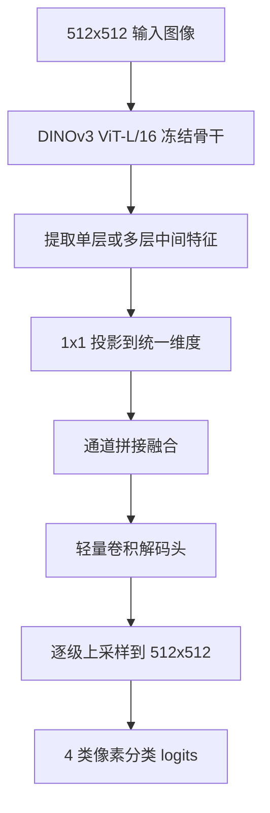

# DINOv3 ViT-L/16 512×512 语义分割

这个目录提供一个独立、精简、可直接训练的语义分割工程：

- 骨干固定为 DINOv3 ViT-L/16。
- 骨干参数完全冻结，只训练分割头。
- 支持任意单层特征，或多层特征融合。
- 默认按 16G 显存做训练配置。
- 所有可调参数集中在 [config.py](config.py)。

## 1. 模型原理

### 1.1 总体结构



### 1.2 为什么这样设计

- DINOv3 ViT-L/16 对 512×512 输入的 patch 特征分辨率是 32×32，语义很强，但空间分辨率较低。
- 骨干冻结后，显存主要花在前向计算而不是反向保存，因此 16G 显存可以稳定训练一个中等规模解码头。
- 多层融合可以结合浅层空间细节和深层语义信息；单层模式则更省显存、更容易调参。
- 解码头使用 1×1 投影 + 深度可分离上采样块，参数量和显存都比重型 FPN/Mask2Former 更友好。

### 1.3 特征尺寸

ViT-L/16 的配置来自原仓库 [dinov3/hub/backbones.py](../dinov3/hub/backbones.py#L318)：

- patch size = 16
- embed dim = 1024
- depth = 24
- num heads = 16
- storage tokens = 4

当输入为 512×512 时：

- patch 网格大小：32×32
- 每个被选中的中间层输出：B × 1024 × 32 × 32
- 如果选择三层，例如 `(11, 17, 23)`：
  先分别投影为 B × 256 × 32 × 32
  再拼接为 B × 768 × 32 × 32
  再融合为 B × 256 × 32 × 32
  然后逐级上采样到 B × 64 × 512 × 512
  最后输出 B × 4 × 512 × 512

## 2. 文件结构

```text
dinov3_seg/
├── __init__.py
├── config.py
├── dataset.py
├── metrics.py
├── model.py
├── train.py
├── eval.py
└── README.md
```

### 2.1 各文件作用

- [config.py](config.py)：统一管理路径、训练超参、骨干层选择、分割头大小。
- [dataset.py](dataset.py)：读取 512×512 PNG 图片和标签，并把标签从 `0/80/160/240` 映射到 `0/1/2/3`。
- [model.py](model.py)：构建冻结的 DINOv3 ViT-L/16 和中等规模分割头。
- [train.py](train.py)：训练入口，保存 `last_head.pth` 和 `best_head.pth`。
- [eval.py](eval.py)：评估入口，输出 loss、mIoU、pixel accuracy、各类 IoU。
- [metrics.py](metrics.py)：基于混淆矩阵计算分割指标。

## 3. 数据组织

默认目录结构：

```text
dinov3_seg/
├── data/
│   ├── train/
│   │   ├── images/
│   │   │   ├── 000001.png
│   │   │   └── ...
│   │   └── masks/
│   │       ├── 000001.png
│   │       └── ...
│   └── val/
│       ├── images/
│       └── masks/
└── weights/
```

约定：

- 图像和标注文件名一一对应。
- 图像是 RGB PNG，尺寸固定 512×512。
- 标注是单通道 PNG，像素值只能是 `0 / 80 / 160 / 240`。
- 读取时直接做 `mask // 80`，得到 4 类标签 `0 / 1 / 2 / 3`。

## 4. 配置说明

所有参数都在 [config.py](config.py) 中，最常改的是这几项。

### 4.1 路径配置

- `paths.train_image_dir`：训练图像目录
- `paths.train_mask_dir`：训练标签目录
- `paths.val_image_dir`：验证图像目录
- `paths.val_mask_dir`：验证标签目录
- `paths.backbone_weights`：本地 DINOv3 ViT-L/16 权重路径
- `paths.eval_checkpoint`：评估时加载的分割头权重路径

默认骨干权重文件名写成 SAT493M 版本：

`dinov3_vitl16_pretrain_sat493m-eadcf0ff.pth`

如果你切换到其他本地权重，至少同步改两处：

1. `paths.backbone_weights`
2. `model.backbone_profile`

其中 `model.backbone_profile` 目前支持：

- `SAT493M`
- `LVD1689M`

这个配置决定了 ViT-L/16 的细节开关是否匹配对应权重，尤其是 `untie_global_and_local_cls_norm`。

### 4.2 特征层选择

- `model.feature_layers = (11, 17, 23)`：默认使用第 12、18、24 个 block 的输出做融合。
- 如果你只想用单层特征，把它改成例如 `(23,)`。
- 层号从 0 开始，取值范围是 `0 ~ 23`。

推荐搭配：

- 最省显存：`(23,)`
- 默认平衡方案：`(11, 17, 23)`
- 更强但稍重：`(7, 11, 17, 23)`

### 4.3 分割头规模

- `model.fusion_dim = 256`
- `model.decoder_channels = (256, 192, 128, 96, 64)`

这是一套适合 16G 显存的中等规模配置。

如果你还想压缩显存，可以改成：

- `fusion_dim = 192`
- `decoder_channels = (192, 160, 128, 96, 64)`

### 4.4 训练超参

默认值：

- `batch_size = 4`
- `grad_accum_steps = 2`
- `eval_batch_size = 6`
- `lr = 3e-4`
- `weight_decay = 1e-4`
- `epochs = 40`
- `amp_dtype = "bf16"`

这组配置对应：

- 单卡 16G
- 冻结 backbone
- 训练中等规模 head
- 有较稳定的吞吐与收敛速度

如果你的 GPU 不支持 BF16，把 `amp_dtype` 改成 `"fp16"`。

## 5. 训练流程

### 5.1 启动训练

在仓库根目录执行：

```bash
python -m dinov3_seg.train
```

训练会自动：

- 加载本地 ViT-L/16 权重
- 冻结全部 backbone 参数
- 仅优化分割头参数
- 每轮验证并更新最佳权重
- 将结果保存到 `paths.output_dir`

输出文件：

- `last_head.pth`：最近一次验证后的分割头
- `best_head.pth`：当前最佳 mIoU 的分割头

注意：checkpoint 只保存分割头和优化器，不保存冻结骨干，文件会更小。

## 6. 评估流程

### 6.1 启动评估

先在 [config.py](config.py) 中设置：

- `paths.backbone_weights`
- `paths.eval_checkpoint`

然后执行：

```bash
python -m dinov3_seg.eval
```

默认输出：

- `loss`
- `mIoU`
- `pixel_acc`
- `class_iou`

## 7. 16G 显存建议

### 7.1 推荐默认配置

- 特征层：`(11, 17, 23)`
- 训练 batch：4
- 梯度累积：2
- 有效 batch：8
- 混合精度：BF16

### 7.2 如果仍然超显存

按顺序缩减：

1. 把 `feature_layers` 改成 `(23,)`
2. 把 `eval_batch_size` 改成 `4`
3. 把 `batch_size` 改成 `2`，同时把 `grad_accum_steps` 改成 `4`
4. 把 `fusion_dim` 改成 `192`

## 8. 核心实现说明

### 8.1 为什么直接调用 `get_intermediate_layers`

原始 DINOv3 backbone 已经在 [dinov3/models/vision_transformer.py](../dinov3/models/vision_transformer.py#L415) 提供了中间层提取接口，且支持 `reshape=True` 直接恢复成二维特征图。

因此这个工程不重复造一套适配器，而是直接复用原生接口：

- 更短
- 更稳
- 更容易和原仓库版本同步

### 8.2 为什么 checkpoint 只存 head

因为任务要求骨干完全冻结，训练过程中 backbone 不更新。

所以保存完整模型是重复存储，既浪费磁盘，也会拖慢保存速度。当前实现只保存：

- head 权重
- optimizer 状态
- epoch
- 验证指标

评估时再重新从本地路径加载 backbone 即可。

## 9. 一句话总结

这个工程的核心思路就是：

用冻结的 DINOv3 ViT-L/16 提供稳定的 32×32 高语义特征，再用一个中等规模、轻量上采样的分割头把它恢复成 512×512 的 4 类分割结果。
