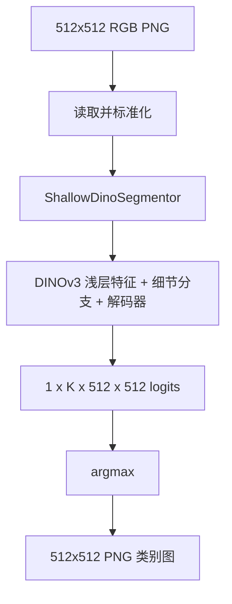

# 单张 512x512 PNG 输入到分割结果的流程

当前流程只支持固定尺寸 PNG，因此推理链路非常直接：

## 数据阶段

[predict_tif.py](./predict_tif.py) 会先收集输入 PNG，再通过 [datasets.py](./datasets.py) 做两件事：

1. 把 RGB 图像转换到 `[0, 1]`。
2. 按当前 backbone 的 mean/std 做标准化。

数据集会严格检查每张输入图是否是 512x512。如果尺寸不对，会直接报错，不再自动 resize。

## 模型阶段

[model.py](./model.py) 当前固定假设输入是 512x512，且该尺寸能被 patch size 整除。因此：

- 不再做 patch 对齐 padding。
- 不再做输出裁边。
- 不再做额外插值恢复。

默认尺寸流如下：

| 阶段 | 张量形状 |
| --- | --- |
| 输入图像 | `[1, 3, 512, 512]` |
| detail feat2 | `[1, 32, 256, 256]` |
| detail feat4 | `[1, 64, 128, 128]` |
| detail feat8 | `[1, 128, 64, 64]` |
| shallow feature | `N x [1, C, 32, 32]` |
| 融合后 | `[1, 128, 32, 32]` |
| decode8 | `[1, 128, 64, 64]` |
| decode4 | `[1, 64, 128, 128]` |
| decode2 | `[1, 32, 256, 256]` |
| decode1 | `[1, 16, 512, 512]` |
| logits | `[1, K, 512, 512]` |

## 输出阶段

推理脚本直接对 logits 做 `argmax`，得到 512x512 的类别图，然后保存成 PNG：

- 若类别编号不超过 255，保存为 8-bit PNG。
- 若类别编号超过 255，保存为 16-bit PNG。

整个过程不再涉及原图尺寸恢复，因为输入和输出尺寸始终固定。